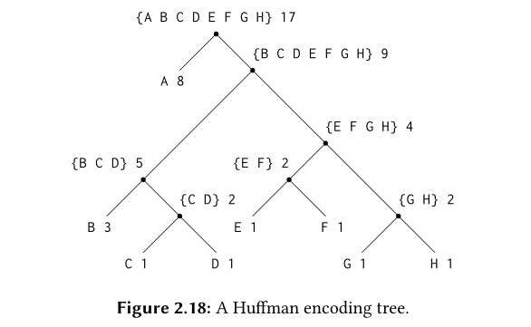

# Huffman Trees

## Intro
Huffman trees are used for representing data as sequences of ones and zereos.

For example ASCII code uses 8-bits to represent each symbol. If we want to distinguish between n symbols, then we need logn bits.
An example to represent the set {A, B, C, D, E, F, G, H} using 3 bits is:

```txt
A 000	C 010    E 100    G 100

B 001   D 011    F 101    H 111
```

Codes like ASCII or the one above which use a fixed number of bits per character are known as *fixed-length* codes.

It is sometimes advantageous to use variable-length code (e.g Morse Code)
which uses different number of bits for each character/symbol. The advantage
in using variable-length is when some symbols in our representation are used
very often, we can assign them shorter code while will also save significant space

Example :
```txt
A 0    C 1010    E 1100    G 1110
B 100  D 1010    F 1101    H 1111
```
One of the problems of variable-length code is that it is hard to know when
you have reached the end of a symbol in reading a message of ones and zereos
Two of ways to solve this are:
1. breaking the message after each symbol (like morse code uses pause after each symbol)
2. Design codes in such a way that no code comes in the prefix of another one (prefix codes)

Huffman Encoding :
One particular method of implementing 2nd is the Huffman Encoding method.
A Huffman code can be represented as a binary tree whose leaves are the symbols 
that are encoded. At each non-leaf node of the tree there is a set containing all 
the symbols in the leaves that lie below the node. In addition, each symbol at a leaf 
is assigned a weight (which is its relative frequency), and each non-leaf node contains a 
weight that is the sum of all the weights of the leaves lying below it.

Example:



## Generating Huffman Trees
Given an “alphabet” of symbols and their relative frequencies, how do
we construct the “best” code? (In other words, which tree will encode
messages with the fewest bits?). The idea is to arrange the tree so that 
the symbols with the lowest frequency come farthest from the root. 
The way we achieve this is :

1. Begin with the set of leaf nodes containing symbols and their frequency
2. Find two leaves with the lowest weight(`left-node` and `right-node`) and combine them to make a
node(`node_eq`) whose wieght is the sum of weight of `left-node` and `right-node`
3. make `left-node` and `right-node` the left and right children of node_eq respectively
4. replace `left-node` and `right-node` with `node_eq`
5. repeat (2-4) untill there is only one node left which will form the root of this tree

Steps for creating the tree in fig 2.18 using the above algorithm :

```txt
Initial {(A 8) (B 3) (C 1) (D 1) 
leaves   (E 1) (F 1) (G 1) (H 1)}

Merge   {(A 8) (B 3) ({C D} 2) 
         (E 1) (F 1) (G 1) (H 1)}

Merge   {(A 8) (B 3) ({C D} 2) 
         ({E F} 2) (G 1) (H 1)}

Merge   {(A 8) (B 3) ({C D} 2) 
         ({E F} 2) ({G H} 2)}

Merge   {(A 8) (B 3) ({C D} 2) 
         ({E F G H} 4)}

Merge   {(A 8) ({B C D} 5) 
         ({E F G H} 4)}

Merge   {(A 8) ({B C D E F G H} 9)}

Final   {({A B C D E F G H} 17)}
merge    
```

