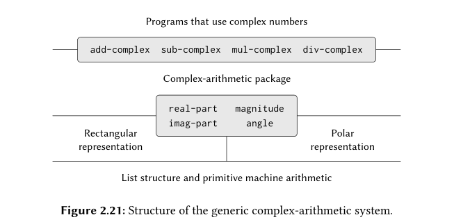

# Multiple Representation for Abstract Data

## Intro
Previously we used data abstraction, a way of structuring systems in such a way that the programs manipulating data can be
specified independent of the choices involed in implementing the data objects themselves.

For example we created data-objects for rational numbers and structured the procedures in such a way that for procedures like
(add-rat, mul-rat, sub-rat) the underlying representation of rational numbers didn't matter. The idea in implementing all our
data-abstractions was to erect an abstraction barrier between the representation(constructors and selectors) and the usage of 
compound-data (in the above case : add-rat, mul-rat, sub-rat)

These data-abstraction are powerful tools for controlling complexity of a system but there are some downsides as well.
- There may be more than one useful representation for a data object, for example complex numbers can have two representations
rectangular and polar forms, both of which are equally useful.

The way we solve the above problem is by using *generic procedures* which are procedures that can operate on data that may be
represented in more than one way.

we implement *generic procedures* the following way:
- data objects with *type tags*, that is data objects that include explicit information for how they are to be processed
- *generic selectors* - selectors which select parts of a data-object irrespective of their representation

## Tagged data
> One way to view data abstraction is an implementation of the "principle of least commitment"

To solve the problem of having both rectangular and polar form representation in the same system,
we add type tags - the symbols `rectangular` or `polar` - as part of each complex number
so we can find what type of representation it uses.

To manipulate tagged data, we need to introduce some new procedures
```scheme
; Procedure which attatches a tag to a data-object
(define (attach-tags type-tag contents)
  (cons type-tag contents))

; Procedure which extracts the tag from a data object
(define (type-tag datum)
  (if (pair? datum)
      (car datum)
      (error "Bad tagged datum: TYPE-TAG" datum)))

; Procedure to extract the actual data from a tagged data-object
(define (contents datum)
  (if (pair? datum)
      (cdr datum)
      (error "Bad tagged datum: CONTENTS" datum)))
```

Example using complex numbers :
```scheme
;; Rectangular representation

; Procedure to tell if a complex number uses rectangular form representation
(define (rectangular? z)
  (eq? (type-tag z) 'rectangular))

; Procedure to extract real part of a rectangular form complex number
(define (real-part-rectangular z) (car z))

; make-from-real-imag-rectangular procedure
(define (make-from-real-imag-rectangular x y)
  (attach-tag 'rectangular (cons x y)))
;; ----------------------------------------------------------------------------

;; Polar Representation

; Procedure to tell if a complex number uses polar form representation
(define (polar? z)
  (eq? (type-tags z) 'polar))

; Procedure to extract real part of a polar form complex number
(define (real-part-polar z)
  (* (magnitude-polar z) 
     (cos (angle-polar z))))

; make-from-real-imag-polar procedure
(define (make-from-real-imag-polar x y)
  (attach-tag 
   'polar
   (cons (sqrt (+ (square x) (square y)))
         (atan y x))))
;; ----------------------------------------------------------------------------

;; generic selectors for both rectangular and polar form representation

; generic selector for real part of a complex number
(define (real-part z)
  (cond ((rectangular? z)
         (real-part-rectangular (contents z)))
        ((polar? z)
         (real-part-polar (contents z)))
        (else (error "Unknown type: REAL-PART" z))))
;; ----------------------------------------------------------------------------

;; contructor for complex numbers

; make-from-real-imag procedure
(define (make-from-real-imag x y)
  (make-from-real-imag-rectangular x y))

; make-from-mag-ang procedure
(define (make-from-mag-ang r a)
  (make-from-mag-ang-polar r a))
;; ----------------------------------------------------------------------------

;; Complex number arithmetic 

; Procedure to add two complex numbers
(define (add-complex z1 z2)
  (make-from-real-imag (+ (real-part z1) (real-part z2))
                      (+ (imag-part z1) (imag-part z2))))
```

The structure of the above program can be summarised by this :
<p align="center">
  
</p>
